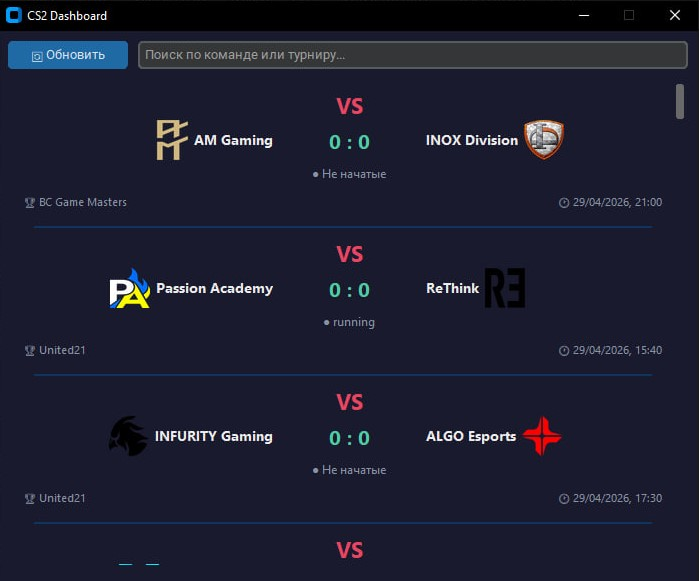

# 🎮 CS2 Dashboard

> Десктопное приложение для просмотра матчей CS2 в реальном времени.
> Данные загружаются через PandaScore API и сохраняются в локальную базу данных.


---

## 📸 Скриншот



---

## ✨ Возможности

- 📋 Список актуальных матчей CS2
- 🏆 Название турнира и дата матча
- 🖼 Логотипы команд (загружаются асинхронно)
- 🔄 Кнопка обновления данных
- 🔍 Поиск по команде или турниру
- 💾 Локальное хранение данных в SQLite

---

## 🛠 Технологии

| Технология | Назначение |
|---|---|
| Python 3.12 | Основной язык |
| CustomTkinter | Графический интерфейс |
| Pillow | Загрузка и обработка логотипов |
| Requests | HTTP-запросы к API |
| SQLite3 | Локальная база данных |
| PandaScore API | Источник данных о матчах |
| Threading | Асинхронная загрузка картинок |

---

## 📁 Структура проекта

API-hltv/
├── data/
│   ├── example.db              # База данных SQLite
│   ├── apps.jpg                # Скриншот рабочего приложения
│   └── defolt_logo_team.png    # Заглушка для логотипа
├── database/
│   └── db.py                   # Работа с БД
├── utils/
│   └── api.py                  # Запросы к PandaScore API
├── views/
│   └── gui.py                  # Графический интерфейс
├── .env                        # API ключ (не публикуется)
├── .env.example                # Шаблон для .env
├── config.py                   # Конфигурация
├── main.py                     # Точка входа
└── requirements.txt

---

## ⚡ Быстрый старт

```bash
# 1. Клонировать репозиторий
git clone https://github.com/username/cs2-dashboard.git
cd api-hltv

# 2. Создать виртуальное окружение
python -m venv venv
venv\Scripts\activate

# 3. Установить зависимости
pip install -r requirements.txt

# 4. Настроить API ключ
cp .env.example .env
# Открой .env и вставь свой ключ от pandascore.co

# 5. Запустить
python main.py
```

---

## 🔑 Получить API ключ

1. Зарегистрируйся на [pandascore.co](https://pandascore.co)
2. В личном кабинете скопируй токен
3. Вставь в файл `.env`:
API_KEY=твой_ключ_здесь

---

## 📝 Лицензия

MIT License

---

## 👤 Автор

**Имя** — [@username](https://github.com/username)